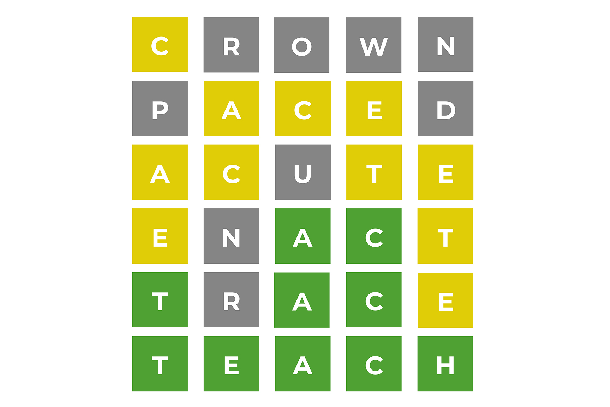

# Overview

This is a deep learning environment for training bots on the game wordle. Why have fun when you can let your computer have fun for you!
## Wordle

https://www.nytimes.com/games/wordle/index.html

Wordle is a word game where you have 6 tries to guess a hidden 5 letter word. Each guess you make gives you information about what the hidden word is. There are 3 results possible for each letter: 
1. the letter is in the word AND in the right spot. 
2. the letter is in the word but not in the right spot.
3. the letter is not in the word

Based on this information, if you choose your words wisely, you can deduce the hidden word.

## How to use

First 

1. run ```python setup.py```
2. install requirements.txt

- run tests
    `python -m pytest tests`

- generate games for dynamics function training
- train the dynamics function
- train the actor and critic via self play

## Strategy

Fundamentally this is a game about information. There is a hidden state - which is the actual word. We know it is a 5 letter work (it is actually 1 of ~2400 possible 5 letter words).
Initially our prior probability of every word being the answer is equal. After we make a guess, ideally we have eleminated many of the available words. You can think of this as collapsing the distribution. Once we have collapsed the distribution to 1 word remaining we know exactly what it is.

Additionally everytime you play it, the hidden word will be different. This makes the game non-stationary. This means that the word we discovered the previous game has no baring on subsequent games. So each game is starting afresh. 

In Reenforcement Learning (RL), this is known as an imperfect information non-stationary game.

A nice heuristic for playing Wordle is to maximize the amount of information gained per guess. This is not necessarily optimal because maximizing information on a given round, may not maximize information gained over 2 or more rounds. 

For this agent however, we will simply be optimizing for the end result. Which will also solve the game in optimum average speed.

## Encodings

To make wordle machine digestible we have to convert the game state into numbers. If we take the following image



Each letter is encoded via the following format. With 0 reserved for padding

- _:0
- a:1  
- b:2
- c:3
- d:4 
- e:5
- f:6
- g:7
- h:8
- i:9
- j:10
- k:11
- l:12
- m:13
- n:14
- o:15
- p:16
- q:17
- r:18
- s:19
- t:20
- u:21
- v:22
- w:23
- x:24
- y:25
- z:26 

Each letter in the word has an associated result.

- 0 : padding
- 1 : Missing (letter not in word)
- 2 : Contained (letter present in word, but in a different position)
- 3 : Exact (letter present and in that exact location)

**State Transition function**
there are 243 (5 squares, 3 possible outcomes for each square, 5^3) possible results. 
- 0 padding
- 1 missing
- 2 contained
- 3 exact
the vector [3,3,3,3,3] corresponds to getting every letter in its correct position.
Because the actual probability function will be quite difficult to make, i expect pretraining the state transition function will make everything much easier. Then we can check the validity of the trained model. If everything is good, training the Policy will be the next step.


**Reward function**
- win           +1 
- no result      0  
- loss          -1 
The reward function: 
- 0 can happen on the first 5 turns
- 1 can happen on any turn
- -1 can only happen on the last turn

Because there is only one vector [3,3,3,3,3] that corresponds to +1 ALWAYS, everything else is either 0 or -1 depending on whether it is the last turn or not. This means we don't need to use a NN to predict the reward, we can hardcode the reward and construct the reward distribution based on a boolean output that predicts whether its the last turn or not. 
Then when we sample S' we will index the corresponding reward.

## Game space

# test

```pytest```

# train

```python main.py``` 

on menu prompt enter 0

# run experiments

```python run_experiments.py```

# weights

Saved network weights

# results

Tensorboard stats

# plots

are in images

# MuZero in wordle

Wordle is a non stationary, imperfect information game. 

Traditionally muzero maps (s,a) -> s' in a deterministic fashion. However, in non-stationary, imperfection informations games, we must map (s,a) -> distribution over s'.
In wordle, given a state s, and action (5 letter word) a, there is a 243 length distribution (3^5) over a (5,3) result vector. 5 letters [0,27] and 3 states [0,3]. With a padding dimension at 0. Then sample the 243 length vector and combine with s to make s'. 

In the same way an algorithm can be made, to maximize the collapse of the probability distribution function. given a state s and available words w, pick the word w that collapses the distribution function the most. At the limit, we will collapse the distribution function down to 1 possibility, when we have all the necessary information to pick the word.

# Credits

thanks to 3b1b and werner-duvaud for some code and inspiration.

https://github.com/3b1b/videos/tree/master/_2022/wordle
https://github.com/werner-duvaud/muzero-general